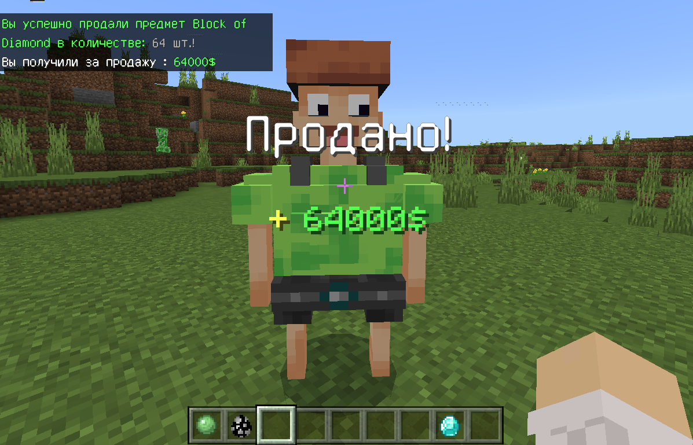

# 🎁Buyer Plugin!

❗ The LLMoney plugin is required: <a href="https://github.com/LiteLDev/LLMoney/releases">Download</a>.

| Native language                       |    C++  |
| Native language of the plugin content |    RU   |
| ----------------- | --------------------------- |

😋 This is a simple code, which add Buyer on your Server!



-----

Releases <a href="https://github.com/MineCoder77/BuyerPlugin/releases/tag/BuyerPlugin">here</a>.

Addon <a href="https://github.com/MineCoder77/BuyerAddon">here</a>.

-----

# 💎 My huge diamond thanks for using this code!

If u want to compilte it by yourself, do the next steps:

1. Download .zip source_code by this command:
```sh
git clone --recurse-submodule https://github.com/MineCoder77/BuyerPlugin.git
```
2. Unzip it.
3. Update your SDK:
```sh
cd SDK
git checkout main
git pull
```
3. Edit info about plugin in version.h(if you need).
4. Compile it!

❗ If u wanna to despawn him, u need to tap on him with slime, when u have a operator permissions.

-----
